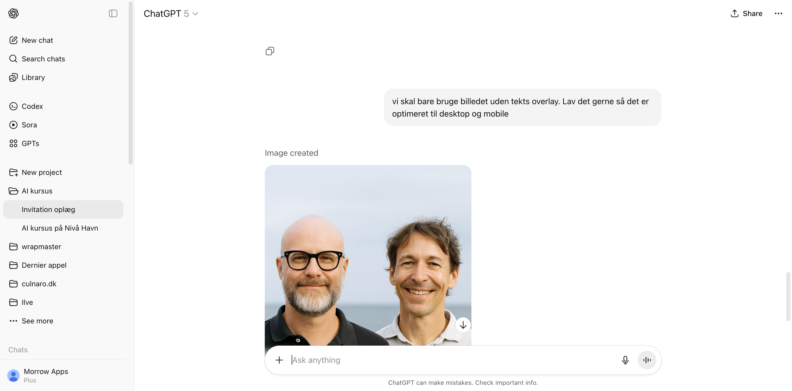
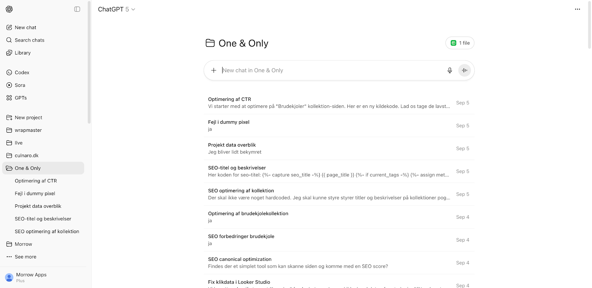

# AI på en formiddag

## Program

|              |                              |
| -            | -                            |
| 09.00        | Kaffe og croissant           |
| 09.15       | AI - fordele og faldgruber             |
| 09.45       | Gruppearbejde            |
| 10.15       | Plenum                       |
| 10.30       | Prompts og øvelser                      |
| 10.45       | Plenum                       |
| 11.00       | Projekter og øvelser                               |
| 11.45        | Opsamling |

## Mål

- Forstå muligheder og faremomenter i AI
- Give præcise prompts og få gode resultater
- Strukturere projekter for kvalitet og overblik

---

> Bliv en **selvsikker og kritisk bruger** af AI.

## Hvad er en LLM? {background-image="./assets/complicated.gif"}

------------------------------------------------------------------------

En **Large Language Model (LLM)** er hjernen bag de AI'er, vi skal bruge i dag.

Tænk på den som en avanceret "auto-complete".

------------------------------------------------------------------------

1.  En stor sprogmodel er blevet **trænet** på enorme mængder tekst
2.  Den har lært **mønstre**, sammenhænge og strukturer i sprog
3.  Den giver det mest **sandsynlige** svar, baseret på sin træning

## Hallucination

En AI "hallucinerer", når den **finder på fakta, kilder eller oplysninger**, som lyder overbevisende, men er forkerte.

---

- **Prompt:** "Hvem var den første danske kvinde på Mount Everest?"
- **AI svarer:** "Lene Gammelgaard var den første danske kvinde på Mount Everest i 1996, som en del af en ekspedition ledet af den berømte sherpa Tenzing Norgay."

---

- **Faktatjek:** Lene Gammelgaard var den første, men Tenzing Norgay døde i 1986 og kunne derfor ikke have ledet ekspeditionen i '96.

------------------------------------------------------------------------

> **Huskeregel:** Stol aldrig blindt på en AI. Verificer altid vigtige oplysninger.

## Bias og etik

- **Bias:** AI'en er trænet på data fra internettet – med alle dets fordomme. Den kan derfor utilsigtet gengive stereotyper.
- **Ansvar:** Hvem har ansvaret, hvis en AI giver et skadeligt råd? Producenten? Brugeren? Dette er stadig et stort, uafklaret spørgsmål.

------------------------------------------------------------------------

> **Din opgave som bruger:** Vær kritisk. Spørg dig selv: "Kan dette være farvet af data? Er denne information troværdig? Kan jeg stå på mål for det?"

## Gruppearbejde

To og to ved bordene

---

Har I oplevet hallucinationer og forkerte svar fra AI?

Hvem har ansvaret for tekst som en LLM spytter ud?

Bruger I allerede AI og har det fungeret for jer?

## Plenum

# Best practices

## Prompts

---

### Skriv effektive "Prompts"

> Kvaliteten af dit output afhænger direkte af kvaliteten af dit input. En "prompt" er din kommando til AI'en.

------------------------------------------------------------------------

|Dårlig Prompt (Uklar)|God Prompt (Målrettet)|
|:--------------------|:----------------------------------|
|"Skriv noget om elbiler."|"Skriv en kort, objektiv tekst på 150 ord om fordele og ulemper ved at eje en elbil i Danmark i 2025. Målgruppen er boligejere."|
|"Hvordan laver jeg en projektplan?"|"Agér som en erfaren projektleder. Lav en trin-for-trin guide til en projektplan for lancering af en ny hjemmeside."|

---

### De 4 grundpiller i en god prompt

Rolle, Opgave, Kontekst, Format

---

1.  **Rolle:** Hvem skal AI'en være?
    - *"Agér som en marketingekspert..."*
2.  **Opgave:** Hvad skal den gøre?
    - *"...skriv 5 forslag til et slogan..."*
3.  **Kontekst:** Hvad er baggrunden?
    - *"...for en ny økologisk café..."*
4.  **Format:** Hvordan skal outputtet se ud?
    - *"...i en punktopstilling."*

---

### Forfining

Dit første svar er sjældent det endelige. Den virkelige magi opstår i dialogen.

------------------------------------------------------------------------

1.  **Du:** "Giv mig nogle ideer til en teambuilding-dag for en IT-afdeling på 20 personer."
    - *AI: Giver en generisk liste: Bowling, go-kart, middag.*
2.  **Du:** "Gode ideer, men det skal styrke samarbejde. Budgettet er 500 kr. pr. person, og det skal være i København."
    - *AI: Giver mere målrettede forslag: Escape room, 'Hackathon', LEGO-workshop.*
3.  **Du:** "Escape room lyder godt. Find 3 udbydere i København og sammenlign deres priser og temaer i en tabel."
    - *AI: Leverer en struktureret tabel med de ønskede informationer.*

------------------------------------------------------------------------

> **Huskeregel:** Se AI'en som en assistent, du instruerer og guider.

## Øvelser: Prompting i praksis

Åbn din computer, tablet eller telefon eller del med din sidemakker

---

**Afprøv prompts**: Giv AI et uklart prompt og omskriv det til et mere målrettet i en ny chat. Hvad fortæller resultaterne dig?

**4 grundpiller i prompting**: Prøv at skabe et prompt som både indeholder en *rolle*, en *opgave*, noget *kontekst* og et *format*.

**Brug forfinings-teknikken**: Start bredt og bliv mere specifik i samme chat. Kan du guide AI på rette vej?

## Plenum

# Projekter og struktur

## Hvorfor organisere?

- Hurtigere overblik over projekter
- Nem adgang til vigtige chats
- Hold styr på filer og data

------------------------------------------------------------------------

------------------------------------------------------------------------

------------------------------------------------------------------------

## Øvelse: Brug Projekter i ChatGPT

Brug din tablet eller laptop eller del med sidemakker. Vi skal ind på ChatGPT.

---

**Tænk over to projekter**: Tænk over to projekter som du gerne vil have hjælp til fra kunstig intelligens. Hvorfor er det en fordel at holde dem adskilte?

**Opret projekter**: Brug ChatGPT gratis og opret to projekter.

**Start en chat**: Begynd en samtale med ChatGPT hvor du forklarer den om det projekt du har valgt at starte med.

# Opsamling

## Projekter og organisering

## Beskyt dine Private Oplysninger

Alt du deler om en online AI, kan potentielt blive set af uvedkommende.

------------------------------------------------------------------------

|**Dette kan du trygt dele** |**Dette bør du ALDRIG dele** |
|:--------------------------------------------|:------------------------------------------|
|Generelle spørgsmål og research|Personnumre (CPR), passwords, kreditkortoplysninger|
|Anonymiserede data *(f.eks. "En kunde har et problem med...")*|Fortrolige forretningsstrategier eller kundedata|
|Kreativ skrivning og brainstorming|Personlige helbredsoplysninger eller private samtaler|

------------------------------------------------------------------------

> **Tommelfingerregel:** Hvis du ikke ville skrive det på et åbent postkort, skal du ikke indtaste det i en offentlig AI.

## Muligheder...

**Hvad AI er fantastisk til i dag:**

- **Assistent:** Få udkast, research, ideer og struktur
- **Hastighed:** Producere store mængder tekst eller mange variationer hurtigt
- **Kreativ partner:** Bryde skriveblokeringer og udforske nye vinkler

## ...og begrænsninger

**Hvor AI stadig har begrænsninger:**

- **Menneskelig forståelse:** Mangler empati og situationsfornemmelse
- **Ægte originalitet:** Skaber ud fra eksisterende data
- **Etisk dømmekraft:** Kan ikke træffe komplekse etiske beslutninger

## Du har prøvet at

- Bruge en AI med forfinings-teknikken
- Forbedre prompts med de fire grundpiller
- Bruge projekter til organisering i ChatGPT

## Dine næste skridt

1.  **Eksperimentér:** Den bedste måde at lære på er ved at prøve sig frem
2.  **Systematisér:** Sorter i dine teknikker og hold fast i de bedste
3.  **Del din viden:** Hjælp kolleger og venner med at blive bedre AI-brugere

## Feedback og spørgsmål

# Tak for i dag!
