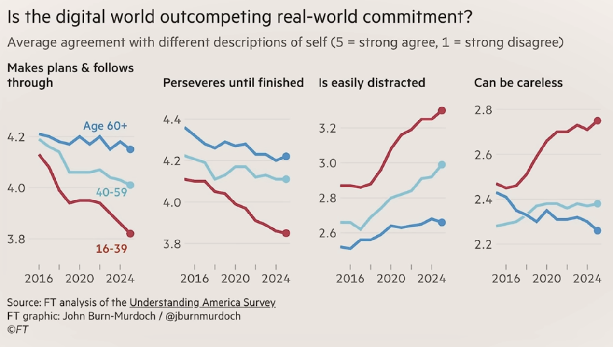

# AI på en formiddag

## Kender I den her fyr {background-image="assets/Larry_Ellison_picture.png"}

## Mål

- Give præcise prompts for at få de bedste resultater.
- Strukturere din arbejdsgang for at sikre kvalitet og overblik.
- Gennemskue og vurdere de svar, du får.
- Bruge AI til at løse konkrete, dagligdags opgaver.
- Beskytte dine data og forstå de etiske spilleregler.

------------------------------------------------------------------------

## Kort sagt

> Bliv en **selvsikker, disciplineret og kritisk bruger** af AI.

## Disciplineret?

## Let's go

## {background-image="./assets/complicated.gif"}

## Hvad er en LLM?

En **Large Language Model (LLM)** er hjernen bag de AI'er, vi skal bruge i dag (som ChatGPT og Gemini).

Tænk på den som en ekstremt avanceret "auto-complete".

------------------------------------------------------------------------

1.  Den er blevet **trænet** på enorme mængder tekst og data fra internettet.
2.  Den har lært **mønstre**, sammenhænge og strukturer i sprog.
3.  Når du stiller et spørgsmål, **forudsiger** den det mest sandsynlige svar, ord for ord, baseret på sin træning.

## Hvad er "Hallucination"?

En AI "hallucinerer", når den **finder på fakta, kilder eller oplysninger**, som lyder overbevisende, men er forkerte.

**Hvorfor sker det?**

## Eksempel på hallucination:

- **Prompt:** "Hvem var den første danske kvinde på Mount Everest?"
- **Mulig hallucination:** "Lene Gammelgaard var den første danske kvinde på Mount Everest i 1996, som en del af en ekspedition ledet af den berømte sherpa Tenzing Norgay."
- **Faktatjek:** Lene Gammelgaard var den første, men Tenzing Norgay døde i 1986 og kunne derfor ikke have ledet ekspeditionen.

------------------------------------------------------------------------

> **Huskeregel:** Stol aldrig blindt på en AI. Verificer altid vigtige oplysninger.

## Etik, Bias og Misinformation

At bruge AI ansvarligt kræver, at vi kender faldgruberne.

- **Bias (Forudindtagethed):** AI'en er trænet på data fra internettet – med alle dets fordomme. Den kan derfor utilsigtet gengive stereotyper.
- **Misinformation:** Fordi AI'er kan skrive overbevisende tekster lynhurtigt, er de et effektivt værktøj til at sprede falske nyheder.
- **Ansvar:** Hvem har ansvaret, hvis en AI giver et skadeligt råd? Producenten? Brugeren? Dette er stadig et stort, uafklaret spørgsmål.

------------------------------------------------------------------------

> **Din opgave som bruger:** Vær kritisk. Spørg dig selv: "Kan dette være farvet af data? Er denne information troværdig?"

# Håndværket – At tale med en AI

## Skriv effektive "Prompts"

Kvaliteten af dit output afhænger direkte af kvaliteten af dit input. En "prompt" er din kommando til AI'en.

------------------------------------------------------------------------

|Dårlig Prompt (Uklar)|God Prompt (Præcis og Kontekstfuld)|
|:--------------------|:----------------------------------|
|"Skriv noget om elbiler."|"Skriv en kort, objektiv tekst på 150 ord om fordele og ulemper ved at eje en elbil i Danmark i 2025. Målgruppen er boligejere."|
|"Hvordan laver jeg en projektplan?"|"Agér som en erfaren projektleder. Lav en trin-for-trin guide til en projektplan for lancering af en ny hjemmeside."|

## De 4 grundpiller i en god prompt:

1.  **Rolle:** Hvem skal AI'en være?
    - *f.eks. "Agér som en marketingekspert..."*
2.  **Opgave:** Hvad skal den gøre?
    - *f.eks. "...skriv 5 forslag til et slogan..."*
3.  **Kontekst:** Hvad er baggrunden?
    - *f.eks. "...for en ny økologisk café..."*
4.  **Format:** Hvordan skal outputtet se ud?
    - *f.eks. "...i en punktopstilling."*

## Øvelse: "Hjælp din kollega"

**Scenarie:** Din kollega skal bede om lønforhøjelse, men ved ikke, hvordan man starter. Kollegaen prøver med prompten: *"Skriv en mail om løn"*.

**Din opgave (2 minutter):**

1.  Diskuter med din sidemand, hvorfor *"Skriv en mail om løn"* er en dårlig prompt.
2.  Skriv sammen en ny og forbedret prompt, der bruger de 4 grundpiller (Rolle, Opgave, Kontekst, Format).

## Juster og forfin svar

Dit første svar er sjældent det endelige. Den virkelige magi opstår i dialogen.

------------------------------------------------------------------------

**Eksempel på forfining:**

------------------------------------------------------------------------

1.  **Du:** "Giv mig nogle ideer til en teambuilding-dag for en IT-afdeling på 20 personer."
    - *AI: Giver en generisk liste: Bowling, go-kart, middag.*
2.  **Du:** "Gode ideer, men det skal styrke samarbejde. Budgettet er 500 kr. pr. person, og det skal være i København."
    - *AI: Giver mere målrettede forslag: Escape room, 'Hackathon', LEGO-workshop.*
3.  **Du:** "Escape room lyder godt. Find 3 udbydere i København og sammenlign deres priser og temaer i en tabel."
    - *AI: Leverer en struktureret tabel med de ønskede informationer.*

------------------------------------------------------------------------

> **Huskeregel:** Se AI'en som en assistent, du instruerer og guider.

# Struktur og overblik

## De to hovedspor

Afklar problemstilling før du begynder.

|Generel chat|Specifik opgave|
|------------|---------------|
|Procesorienteret|Resultatorienteret|
|Åben, undersøgende prompt|Lukket, handlingsorienteret prompt|
|Dialog og inspiration|Delegering og resultat|
|Indskydelser og forhandling|Instruktioner og ressourcer|
|Sparringspartner|Underordnet|
|Brug den indbyggede viden|Du fodrer AI med relevant indhold|

## Øvelse: Brug ChatGPT på to måder

------------------------------------------------------------------------

### Del 1: Identificér typen (10 min)

**Opgave:** Læs følgende prompts og beslut, hvilken type hver er

1.  “Hvad er forskellige måder at strukturere en workshop på?”
2.  “Lav en workshopplan til torsdag kl. 14 med 3 øvelser og pauser.”
3.  “Hvad skal man være opmærksom på, når man skriver en god jobannonce?”
4.  “Skriv en jobannonce til en UX-designer med fokus på bæredygtighed.”

------------------------------------------------------------------------

### Del 2: Omskriv og test (10–15 min)

**Opgave:** Find på en kort “uklar” prompt, og omskriv den til

1.  En **generel/udforskende** version
2.  En **specifik/målrettet** version
3.  *(Valgfrit)* Test begge i ChatGPT og sammenlign svarene

------------------------------------------------------------------------

### 💬 Refleksion i plenum (5 min)

Diskutér

- Hvornår har du brug for sparring – og hvornår bare et hurtigt resultat?
- Hvordan kan du bruge de to tilgange mere bevidst i dit eget arbejde?
- Hvilke faldgruber er der, hvis man blander dem?

------------------------------------------------------------------------

# Organisering og tilrettelæggelse

## Stikord

Foldere / Projekter

Hukommelse

Genopfriskning

Genoptag

## Hvorfor organisere?

- Hurtigere overblik
- Nem adgang til vigtige chats
- Mindre rod i arbejdsgangen
- Lettere overlevering til kollega

## Projekter

- Gruppér chats, filer og noter per projekt
- Bliv enig om en struktur med teamet
- Skab klar adskillelse mellem kunder

------------------------------------------------------------------------

------------------------------------------------------------------------

# Kontekst

## Når et prompt ikke er nok

Det er ofte nødvendigt at fodre AI med information ud over det som kan være i en almindelig prompt.

Det handler om at styre den *sammenhæng* som AI'en skal arbejde inden for.

## Problemer

1.  Fejlbehæftet information
2.  Manglende information
3.  For meget irrelevant information

# Pause {background-color="white"}

# Praktisk anvendelse

## Brug AI til konkrete opgaver.

|Opgave|Eksempel-prompt|
|:-----|:--------------|
|**Skrive E-mails**|"Skriv en venlig, men formel e-mail til vores kunder, hvor vi informerer om, at kontoret er lukket på Grundlovsdag den 5. juni."|
|**Opsummere**|"Opsummér de vigtigste pointer fra denne tekst \[indsæt tekst\] i 5 punkttegn. Fokuser på økonomiske konsekvenser."|
|**Brainstorme**|"Jeg skal finde på et navn til en ny podcast om bæredygtighed i hverdagen. Giv mig 20 kreative navneforslag."|
|**Planlægge**|"Lav et udkast til en tidslinje for et 'flytte kontor'-projekt. Startdato 1/9, slutdato 30/11. Inkluder faser som planlægning, pakning, flytning og opsætning."|

## Øvelse: Planlæg en Rejse

**Din opgave (5 minutter):**

1.  Åbn din foretrukne AI-assistent (f.eks. Gemini eller ChatGPT).
2.  Planlæg en 3-dages weekendtur til Prag udelukkende ved hjælp af AI'en.
3.  **Du skal som minimum have:**
    - Forslag til transport (fly/tog).
    - 3 forslag til hoteller i forskellige prisklasser.
    - En dagsplan for lørdag med seværdigheder og et restaurantforslag.

------------------------------------------------------------------------

> Brug forfinings-teknikken. Start bredt og bliv mere specifik.

## Værktøjer og sikkerhed

Forskelle på AI-modeller.

Der findes mange forskellige AI-modeller, og de har hver deres styrker. Her er en generaliseret sammenligning.

------------------------------------------------------------------------

|Egenskab|**ChatGPT (OpenAI)**|**Gemini (Google)**|
|:-------|:---------------|:--------------|
|**Primær Styrke**|Ofte meget kreativ, stærk i dialog og til at generere menneskelignende tekst.|Ofte stærk i integration med andre Google-værktøjer, research og "real-time" data.|
|**Svaghed**|Kan have en "ældre" vidensbase (afhængig af version).|Kan nogle gange være mere "forsigtig" eller "politisk korrekt" i sine svar.|
|**Bedst til...**|Kreativ skrivning, brainstorming, sparring, manuskripter.|Research, planlægning, opsummering af nyere information, integration med services.|

------------------------------------------------------------------------

> **Anbefaling:** Prøv dem begge! Brug det værktøj, der passer bedst til opgaven.

## Øvelse: Sammenlign Resultater

**Din opgave (5 minutter):**

1.  Vælg en af de følgende prompter:
    - "Skriv et kort digt om efterår i København."
    - "Forklar begrebet 'fotosyntese' som var jeg 10 år gammel."
2.  Kør den **præcis samme prompt** i både ChatGPT og Gemini (eller en anden AI).
3.  Sammenlign resultaterne. Hvad er forskellene? Hvilket svar foretrækker du, og hvorfor?

## Beskyt dine Private Oplysninger

Alt du deler om en online AI, kan potentielt blive set af uvedkommende.

------------------------------------------------------------------------

|**Dette kan du trygt dele** \  (Offentlig info)|**Dette bør du ALDRIG dele** \  (Følsom info)|
|:--------------------------------------------|:------------------------------------------|
|Generelle spørgsmål og research|Personnumre (CPR), passwords, kreditkortoplysninger|
|Anonymiserede data \  *(f.eks. "En kunde har et problem med...")*|Fortrolige forretningsstrategier eller kundedata|
|Kreativ skrivning og brainstorming|Personlige helbredsoplysninger eller private samtaler|

------------------------------------------------------------------------

> **Tommelfingerregel:** Hvis du ikke ville skrive det på et åbent postkort, skal du ikke indtaste det i en offentlig AI.

# Opsamling

## Muligheder...

**Hvad AI er fantastisk til i dag:**

- **Assistent:** Få udkast, research, ideer og struktur.
- **Hastighed:** Producere store mængder tekst eller mange variationer hurtigt.
- **Kreativ Partner:** Bryde skriveblokeringer og udforske nye vinkler.
- **Forenkling:** Forklare komplekse emner på en letforståelig måde.

## ...og begrænsninger

**Hvor AI stadig har begrænsninger:**

- **Faktuel Pålidelighed:** Kræver altid faktatjek.
- **Menneskelig Forståelse:** Mangler empati og situationsfornemmelse.
- **Ægte Originalitet:** Skaber ud fra eksisterende data.
- **Etisk dømmekraft:** Kan ikke træffe komplekse etiske beslutninger.

## Du har prøvet

- Bruge en AI som sparringspartner.
- Sammenligne resultater fra forskellige værktøjer.
- Skrive kreative tekster og planlægge et arrangement.
- Hjælpe en kollega med at skrive en god prompt.

## Dine næste skridt

1.  **Eksperimentér!** Den bedste måde at lære på er ved at prøve sig frem.
2.  **Vær kritisk.** Forhold dig altid nysgerrigt og kritisk til de svar, du får.
3.  **Del din viden.** Hjælp dine kolleger og venner med at blive bedre AI-brugere.

# Tak for i dag!
